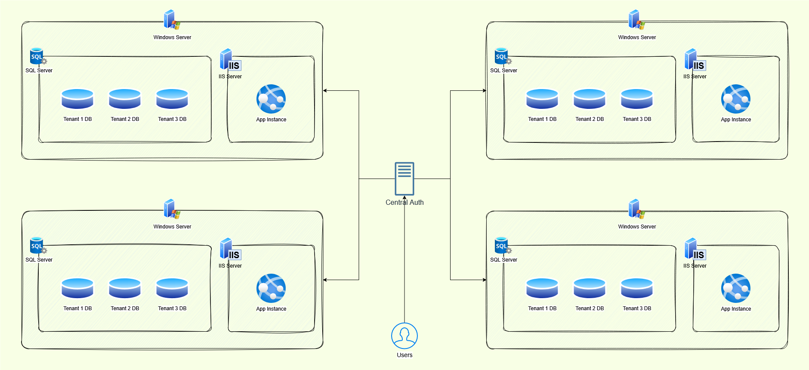
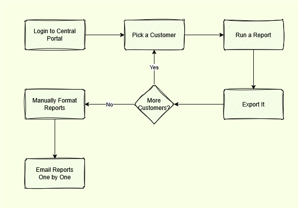

Once upon a time in 2015, I was working on an EHR system that was deployed on multiple servers across the US (around 50+ locations). Each server had its own IIS + SQL Server setup and each server hosted multiple tenants (one DB per tenant). From a system perspective, this worked fine.

From an operations perspective, it was painful.

Support and account managers (myself being one at that time) regularly needed to run the same set of reports for multiple customers, validate them, make them pretty, and send them out. Doing this one customer at a time was time consuming, and annoying, and it needed to be less so.

## The Setup

- One IIS + SQL Server per Data Center
- Multiple tenants per server
- One database per tenant
- Separate user stores per server (same username could exist in multiple places)

There *was* a shared internal portal that support could use to log into different instances. It also allowed running predefined SQL reports, but only for a single customer at a time.

That was the annoying part.

## The Problem

The typical workflow looked like this:

This was slow, error-prone, and honestly a bad use of people’s time. I had 10+ accounts, this could easily eat up the first half of my dat.

## The Approach

Instead of changing the EHR system or building some big centralized service (which I had no say over or access to), I went with the simplest thing that could work:

A small **.NET WPF desktop app** for internal users.

No production system changes, no cross-server magic, no new infrastructure.

## What the App Did

The app was intentionally boring.

- It had a mapping of **Account Managers → Their Assigned Customers**
- Users could select:
  - One or more customers
  - One or more predefined reports
- The app would:
  - Connect to each tenant database via the central portal thingy
  - Run the selected SQL
  - Export the results to formatted Excel files

Each report was saved to a folder with consistent naming so people could easily tell what was what.

## Validation and Sending

Healthcare data means mistakes are expensive, so I didn’t try to fully automate delivery.

Instead:

- Users reviewed the generated Excel files
- Fixed anything if needed
- Then used the same app to send the reports out in a batch

This kept humans in the loop where it mattered.

## Why This Worked

- It removed repetitive manual steps
- It standardized report output
- It didn’t require touching regulated production code
- It fit how support teams actually worked

Sometimes the right solution is not a distributed system, it’s just a tool that saves people time.

## Things I’d Do Differently Now

With more time (or if I were building this today), I’d probably:

- Centralize report definitions instead of shipping them with the app
- Add better execution logs and audit history
- Eventually move it to an internal web tool

But for what we needed at the time, this solved the problem cleanly.

---

*This wasn’t a “big architecture” win — just a practical one that made people’s day a little easier.*
