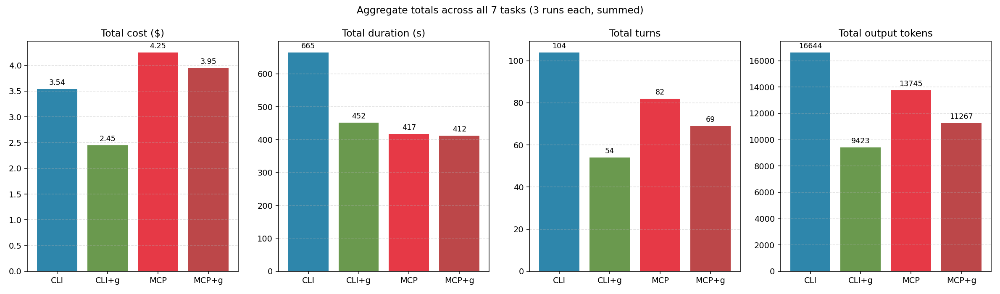

A few weeks back, there was a discussion at work about whether we should rewrite our CLI-based workflow tooling as MCP servers. A lot of smart people had strong opinions. Most of them, including a couple of leadership folks, believed MCP is straight-up better. Faster, cleaner, more structured, and therefore cheaper and more efficient for AI agents.

I wasn't sure. On paper MCP sounds better for a bunch of reasons, but "sounds better" isn't a benchmark. So I ran one.

## The Setup

I've been maintaining [graph-cli](https://github.com/afroze9/graph-cli), a .NET global tool for Microsoft Graph (email, calendar, Teams chat, SharePoint, that kind of thing). The useful part for this experiment is that graph-cli exposes the *same functionality* two ways:

1. As a command-line tool invoked from a shell (`graph-cli mail list --top 10`)
2. As a built-in MCP server that an agent can call directly (`mcp__graph-cli__mail_list`)

Same underlying Graph API calls. Same auth. Same data. The only thing that changes is how Claude talks to the tool.

So I wrote a Python script that runs the same seven read-only tasks through four configurations:

- **CLI** — Claude calls graph-cli through the Bash tool, minimal prompt ("use graph-cli via Bash")
- **CLI + hints** — same, but the system prompt contains a small cookbook of the commands for the benchmarked tasks (this is what our real workflow docs do)
- **MCP** — Claude calls graph-cli's MCP server directly, minimal prompt
- **MCP + hints** — same MCP surface, with a matching cookbook of tool names per task

Three runs per task per configuration, 84 runs total. Everything measured from Claude's usage envelope (`--output-format json` gives you input tokens, output tokens, cache reads, cost, duration, turn count).

## What I Found

Here's the totals picture:



Four bars, four metrics. The most interesting thing isn't which configuration wins. It's that *no single configuration wins all four*.

- **CLI + hints is the cheapest** at $2.45, beating MCP + hints ($3.95) by about 38%
- **MCP + hints is the fastest** at 412 seconds, beating CLI + hints (452s) by about 40 seconds
- CLI + hints also had the fewest turns (54 vs 69 for MCP + hints)
- MCP modes emitted fewer total output tokens

If your question is "which is better for cost?", the answer is CLI + hints by a wide margin. If your question is "which is fastest?", it's MCP + hints, but only by a hair on a realistic workday.

## Why I Thought MCP Would Win

Before running this, I had two assumptions:

1. MCP's persistent stdio process avoids starting graph-cli fresh every time, so it should be way faster per call
2. MCP's structured tool schemas should save the model from exploration, so it should use fewer turns

Assumption one is true. Assumption two is true when there are no hints. But once you add hints to CLI, the turn count drops *below* MCP's. Here's what I saw:

- CLI (minimal): 104 turns, with a lot of "let me check --help" and retries
- CLI + hints: 54 turns, the lowest of all four
- MCP (minimal): 82 turns. Schemas help, just not as much as a cookbook
- MCP + hints: 69 turns. Schemas plus cookbook helps, but MCP already had partial priming from the schemas

Adding hints had very different effects on each surface:

- On CLI, hints cut cost by about 30%
- On MCP, hints cut cost by only about 7%

The reason is simple. MCP's schemas already do part of the job a cookbook does, so adding explicit guidance has less marginal benefit.


## The Per-Turn Numbers Were the Eye-Opener

Divide total cost by total turns and you get a cost-per-turn figure that isolates per-turn overhead:

- CLI: $0.034 per turn
- CLI + hints: $0.045 per turn
- MCP: $0.052 per turn
- MCP + hints: $0.057 per turn

MCP's per-turn cost is higher. Always. Even when it had fewer turns total, each turn was more expensive.

This one surprised me. I dug through the token composition and figured out why: MCP ships the entire tool schema catalog as part of every single turn's input. Yes, it's cached after the first turn, but cached input tokens still cost something (~10% of standard input). graph-cli exposes around 50 tools, and that schema block is not small. Compare that to Bash, which has one fixed tool definition.

So MCP wins on raw per-call latency (no process spawn, connection reuse, warm auth) but loses on per-turn cost (the schema catalog is always in the input).

## The Thing MCP Just Can't Do

Here's what I keep coming back to. On my benchmark, MCP looks fine. $3.95 vs $2.45 isn't nothing, but it's not catastrophic.

But the benchmark tasks were all "fetch and return" operations. List ten emails. Check today's calendar. Find this chat. The model consumes the full response as-is.

Real work often involves filtering, projecting, or aggregating. "Find the three invoices from last week." "Count how many meetings I had with external attendees this month." "Give me the subject of the last message in each of my twenty most active chats."

With a shell I can do things like this:

```bash
graph-cli mail list --top 50 --folder Inbox \
  | jq '[.[] | select(.bodyPreview|test("invoice";"i")) | {from, subject}]'
```

One tool call. jq filters fifty emails down to the matches. Only about three records reach Claude. The rest never touch the model's context.

MCP has no equivalent. It has to ship all fifty records into context, and then the model filters in its head, re-reading every record it sees. If the filter needs a field that isn't in the list response (like the full body), the MCP path degrades further. One tool call to list, then N tool calls to fetch each full message, then in-model filtering.

None of my benchmark tasks use piping. So the numbers in the table actually *understate* CLI's advantage on realistic workloads.

## What I'd Actually Use

I'm sticking with CLI plus hints. My personal workflow automation is organized as a repo with one folder per task type (email, calendar, chat, Jira, notes, and so on), and each folder has its own CLAUDE.md that lists the relevant commands and any conventions for that task. When Claude works in a folder, that file auto-loads into context. It's effectively the "CLI + hints" configuration from the benchmark, scoped per task type rather than applied globally, and it's the condition under which CLI comes out both cheapest *and* competitive on latency.

The nice side effect of this setup is that the priming is human-writable markdown. I can read it, edit it, add a new command, or document an edge case. It evolves with the workflow. MCP's schemas are machine-generated from the tool's source and are fine for capability discovery, but they're not the right place to encode the kind of "when you're doing X, prefer Y because of Z" knowledge that makes an agent actually useful.

MCP makes sense when:

- Latency matters more than cost (synchronous user-facing flows)
- The workload is lookup-heavy and doesn't need filter or transform
- You don't have good workflow priming, or you want the tool to "just work" without per-project tuning

MCP doesn't make sense when:

- You're doing a lot of filter/aggregate operations over list responses
- You've already got decent workflow docs that teach the CLI
- Cost is a primary concern

## Closing Thought

The takeaway I'd give anyone building agent tooling: "better tool surface" is a workload-dependent question, not an absolute one. A persistent stdio MCP server is genuinely a better architecture for some things. A shell-invoked CLI with access to pipes is genuinely better for others.

Also, benchmark your own stuff. I almost accepted the "MCP is just better" framing until I ran the numbers. Turns out the thing I'd already spent time building and priming into our workflows was already the cheaper option.

The full methodology, scripts, and data are on GitHub: [afroze9/token-benchmarks](https://github.com/afroze9/token-benchmarks).

---

*N = 3 per cell, so take the exact numbers with a grain of salt. The directional effects are stable across runs, but absolute cost can shift by 10-15% day to day based on Claude API load and the volume of data in the test mailbox.*
